<div align="center">

# B0uncer - Beta 

**Shell-level firewall for Claude Code.**  
Every command Claude runs is evaluated before it touches your system.




</div>

---

## How it works

Claude Code runs shell commands as `bash -c "..."`. B0uncer replaces `bash`. Before any command executes, B0uncer evaluates it against a rule set and either **blocks** it (exits 1, prints reason) or passes it through to real bash via `syscall.Exec` — zero overhead on allowed commands.

A background dashboard daemon logs every decision to SQLite and serves a live UI at `http://localhost:3456`.

```
Claude Code  →  b0uncer -c "rm -rf /"
                    │
                    ▼
              evaluate rules
                    │
            ┌───────┴────────┐
          block             allow / warn
            │                    │
     print reason          syscall.Exec
       exit 1              (real bash)
```

---

## Install

Requires [Go 1.21+](https://golang.org/dl).

```bash
git clone https://github.com/b0uncer/b0uncer
cd b0uncer
chmod +x install.sh uninstall.sh
./install.sh
```

The script builds the binary, saves your real bash path to `~/.b0uncer/config.json`, copies default policies, and installs to `/usr/local/bin/b0uncer`.

---

## Connect to Claude Code

**Option A — project-level** (`.claude/settings.json` in your repo):
```json
{
  "shell": "/usr/local/bin/b0uncer"
}
```

**Option B — one-off session:**
```bash
SHELL=/usr/local/bin/b0uncer claude
```

---

## Dashboard

```
http://localhost:3456
```

Starts automatically as a detached daemon on the first command. Shows every decision in real time — blocked in red, warned in amber, allowed in green.

---

## Built-in rules

### Blocked

| Pattern | Reason |
|---------|--------|
| `rm -rf /` | Delete root filesystem |
| `rm -rf ~` | Delete home directory |
| `:(){:\|:&};` | Fork bomb |
| `dd if=/dev/zero` | Wipe disk |
| `mkfs.` | Format filesystem |
| `\| bash` / `\| sh` | Pipe to shell |
| `> /dev/sd` | Write directly to disk |
| `shred /dev/` | Shred disk device |
| `/etc/shadow` | Read password hashes |
| `base64 -d \| bash` | Execute encoded payload |
| `/.aws/credentials` | AWS credentials |
| `/.ssh/id_rsa` | SSH private key |

### Warned (logged, command still runs)

`sudo`, `chmod 777`, `chmod -R`, `kill -9`, `npm install -g`, `pip install`, `apt-get install`, `wget`, `curl -o`

---

## Customize

Edit `~/.b0uncer/policies.json`:

```json
{
  "custom_block_patterns": ["production-db", "DROP TABLE"],
  "custom_warn_patterns":  ["deploy", "migration"],
  "log_allowed_commands":  true
}
```

Changes take effect on the next command — no restart needed.

---

## Uninstall

```bash
./uninstall.sh
```
